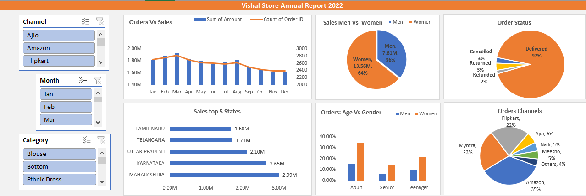

# 📊 Vishal Store – Excel Sales Analysis Dashboard

## Project Overview
An Excel-based sales analysis dashboard built using Vishal Store retail data.  
The project analyzes sales performance using KPIs, pivot tables, and interactive visuals to generate business insights.

## Key KPIs
- Total Sales  
- Total Orders  
- Delivered / Cancelled / Returned Orders %  
- Sales by Gender  
- Sales by Age Group  
- Top States by Sales  
- Sales by Channel  

## KPI Logic
- Total Sales: `SUM(Sales)`  
- Total Orders: `COUNTA(Order ID)`  
- Order %: `(Order Type / Total Orders) * 100`  
- Other KPIs calculated using Pivot Tables

## Tools & Skills
- Microsoft Excel  
- Data Cleaning  
- Pivot Tables & Charts  
- KPI Analysis  
- Dashboard Design  

## Business Value
This project shows KPI-driven analysis and business understanding, not only charts.  
It is suitable for data analyst and entry-level analyti
